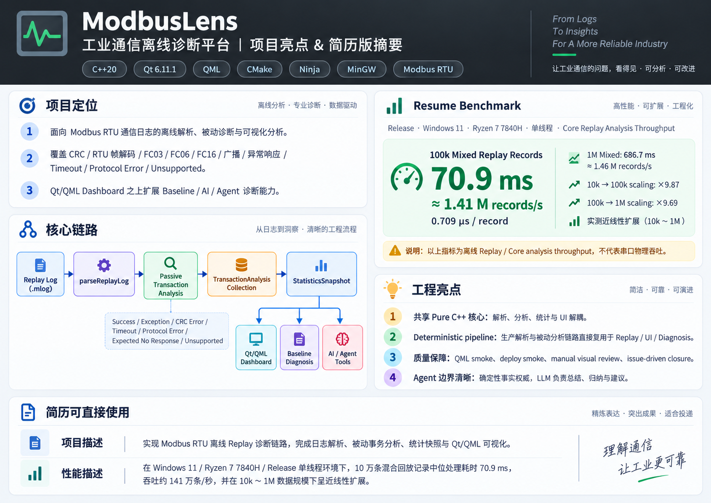

# ModbusLens

基于 **C++20 / Qt6（Quick/QML）** 的 **Modbus RTU 通信分析与故障诊断工具**：把难以阅读的原始串口通信，转成可解释、可复查的事务（Transaction）、统计与自然语言诊断。同时是一个开发过程**全程可追溯**的软件工程项目（任务档案 / Issue / ADR / 每日 devlog 全部落在仓库里）。

- **Simulator** — 零硬件产生确定性 Modbus 流量（黄金演示批次）
- **Replay** — 加载 `.mlog` 历史日志离线重新分析（开发、测试、演示、复盘）
- **Serial** — 经真实串口（USB-RS485）执行**单次 FC03 读**并分析（主动能力边界见 Limitations）
- **Pure C++ 确定性分析核心** — CRC / 事务 / 统计 / 基线诊断全部零 Qt、零 LLM 依赖
- **Baseline Diagnosis** — 确定性规则诊断，无需 API Key、无需网络
- **AI Explanation** — 可选的 LLM 自然语言解释（ModelScope）
- **Read-only Agent** — 用户自由提问，模型按需调用三个只读工具查询确定性事实

核心原则：**AI is interpreter, not detector**——CRC 正确性、TransactionStatus、Timeout、异常码、统计与延迟全部由 deterministic Core 决定；LLM 只解释，不产生协议事实。

---

## 概览

三条数据源归一为**同一套事务 → 统计 → 诊断**视图：

```text
Simulator (确定性生成) ─┐
Replay    (.mlog 离线)  ─┼─► Deterministic Modbus Core（协议解析 / 事务分析 / 统计 / 规则诊断，Zero Qt）
Serial    (单次 FC03)   ─┘            │
                                      ▼
                          App/Controller 层（QML ↔ C++ 边界）
                                      │
                       QML UI（统计卡 / 事务列表 / 诊断面板）  ◄── 可选：AI 解释 / 只读 Agent
```

## 核心亮点

### 1. Pure C++ 的 Modbus RTU 协议核心

- CRC-16/MODBUS（按位实现 + 规范向量对拍验证）、RTU 帧模型与编解码、FC03 语义解码器、**FC06 与 Function 0x10（Write Multiple Registers）的被动（passive）语义分析**——注意：被动理解**不等于**主动写能力，产品不提供写寄存器功能。
- 每笔事务归一为 **7 类事务状态**（Pending / Success / Exception / CrcError / Timeout / ProtocolError / ExpectedNoResponse），并正交保留 13 个结构化业务 Issue：**9 类响应侧 business Issue（TransactionIssue）+ 4 类请求侧 Issue（TransactionRequestIssue）**。
- 协议核心零 Qt、零网络、零 LLM——可独立单元测试与复用。

### 2. 三模式统一分析管线

`parse / 采集 → analyzeObservedTransaction → TransactionAnalysis → 统计快照 → 基线诊断`：Simulator、Replay、Serial 产生**完全相同的结构化结果与统计口径**（黄金演示批次与 `demo_v1.mlog` 回放的统计快照严格相等，有自动化测试锁定）。

### 3. Deterministic Diagnosis + 只读 AI/Agent

- 基线诊断是**确定性规则引擎**：只说“观察到什么 + 建议检查什么”，不宣称物理根因。
- 可选的 AI 解释与 **read-only Agent**：Agent 只有三个只读工具——`get_session_summary`、`get_recent_anomalies`、`get_transaction_detail`——写能力在类型层面不存在。

### 4. Replay 性能

离线 `.mlog` 回放链路（解析 + 被动分析 + 统计，Release / 本机）10 万条混合记录中位数 **70.9 ms ≈ 141 万 records/s（约 0.709 µs/record）**；100k → 1M 实测近线性扩展。**这只是离线 Replay/Core Analysis Throughput，与 RS-485 物理层吞吐无关**。完整口径、逐轮原始数据与独立复测见 [docs/10_REPLAY_PERFORMANCE_BENCHMARK.md](docs/10_REPLAY_PERFORMANCE_BENCHMARK.md)。

## 架构



Simulator / Serial / Replay 三种模式最终复用同一个 deterministic analysis core；Presentation、Diagnosis、AI、Agent 只消费它产出的结构化结果。QML 是唯一 UI；Qt 类型只允许出现在 App/Adapter 层。

## 三种模式

| Mode | Purpose | Input | Key Behavior |
| --- | --- | --- | --- |
| Simulator | 零硬件演示 / 确定性流量 | 内置虚拟从站 | 一键生成 4 笔黄金批次（Success / Exception 0x02 / CRC Error / Timeout） |
| Serial | 真实设备单次读取 | USB-RS485 串口（8N1） | **只读 FC03**；一次一笔事务；transport error 与 Modbus Timeout 严格分离 |
| Replay | 历史日志离线复盘 | `.mlog` 文本日志 | 整批瞬间重新分析；语法错误整体失败、坏请求/不支持功能码按记录保留事实 |

## 诊断架构

```text
Modbus Core（协议事实）
   → TransactionAnalysis（7 状态 + 正交 issue 集合）
   → Statistics / Baseline Diagnosis（确定性）
   → Read-only Agent Tool Adapter（get_session_summary / get_recent_anomalies / get_transaction_detail）
   → Agent Runtime（有限轮次 FSM + 预算硬上限）
   → LLM（只解释既有事实）
```

## Benchmark

以下为已归档的 Resume Benchmark **canonical run**（Release、Windows、本机；混合记录构成未落库的边界已在文档中声明，方法与时数据见 [docs/10_REPLAY_PERFORMANCE_BENCHMARK.md](docs/10_REPLAY_PERFORMANCE_BENCHMARK.md)）：

| 规模 | Core Replay Analysis 中位用时 | 吞吐 | 单条耗时 |
| --- | --- | --- | --- |
| 100k | 70.9 ms | ≈1.41 M records/s | ≈0.709 µs/record |
| 1M | 686.7 ms | ≈1.46 M records/s | ≈0.687 µs/record |

- 跨规模扩展（canonical 口径）：**100k → 1M；10× records；≈9.7× median processing time；observed near-linear scaling**。
- Independent reruns showed expected local CPU/scheduling variance; details are documented in [docs/10_REPLAY_PERFORMANCE_BENCHMARK.md](docs/10_REPLAY_PERFORMANCE_BENCHMARK.md)。
- 口径明确：**offline Replay pipeline / Core analysis throughput**，单线程、本机相对值——不是 serial/RS-485 physical throughput，不构成跨机器性能承诺。

## 工程与验证

设计 → 实现 → 构建 → 测试 → Review → 文档 → Git 提交，闭环可追溯。验证链包括：协议/CRC 单元测试、Replay 解析与回放矩阵、Serial 会话测试、规则诊断、AI 客户端（localhost fake provider，零真实网络）、Agent 工具/Runtime、UI bridge、QML 加载 smoke、独立部署 + minimal-PATH 冒烟，以及多个阶段的人工视觉验收（Manual Review PASS 记录在案）。当前自动测试：**ctest 24/24**（详见 [PROJECT_STATUS](docs/PROJECT_STATUS.md)）；任务档案、Issue、ADR、每日 devlog 全部留存于 `docs/`。

## Build & Run

环境要求与平台细节：[docs/ENVIRONMENT.md](docs/ENVIRONMENT.md)（Qt ≥ 6.5，本项目基线 6.11.1；CMake ≥ 3.21）。

```bash
# Configure / 构建 / 测试（Qt 位于系统默认位置时使用公开 preset）
cmake --preset debug
cmake --build --preset debug
ctest --preset debug
```

说明：`--preset release` 对应 Release 构建；`debug-local` / `release-local` 是仅存在于本机、被 `.gitignore` 忽略的私有 preset（见 ENVIRONMENT.md）。运行：

```bash
./build/debug/modbuslens.exe        # Windows 下对应 build\debug\modbuslens.exe
```

独立部署（免 Qt 开发环境）：

```bat
scripts\deploy_windows.bat   # 产出 build\deploy\ModbusLens.exe + 全部运行时依赖
```

没有真实设备也可以完整体验：运行 **Simulator 黄金演示批次**，或加载 `samples/demo_v1.mlog` 使用 Replay；两者统计口径严格一致。

## 当前能力边界（Current Scope & Limitations）

- **不是**完整 SCADA、不是完整 Modbus Master、**没有** AI 自动控制设备的能力。
- Serial 主动能力 = **单次 FC03 读**；FC06 / Function 0x10 仅存在于 **Replay 被动分析**（passive understanding），没有任何写寄存器通道。
- Replay 是 transaction-oriented 批量重析（无实时播放/调速）；`.mlog` v1 语法保持稳定。
- 未实现 t1.5/t3.5 时序分析（Serial 采用 transaction-aware framing）；未采集 UART parity/framing error 明细。
- 没有 register map / 工程单位与业务语义层（异常码 0x02 可指向“非法数据地址”并建议核对寄存器映射，但不回答具体哪个寄存器）。
- Agent 永远 read-only（三个工具），无写工具、无 RAG/MCP/multi-agent、无对话历史。
- AI/Agent 依赖可选的环境变量 API Key（BYOK）；核心诊断与全部三模式**不依赖** LLM。

## 仓库结构

```text
src/      C++20 生产代码（core/ 纯逻辑 · replay/ · serial/ · ui/ QML adapter）
tests/    ctest 24 个测试目标（单元 / 组件 / 集成）
samples/  .mlog 演示与验收样本（demo_v1.mlog 为 canonical 黄金样本）
docs/     架构 · 测试策略 · 性能基准 · 任务档案 · Issue · ADR · devlog
scripts/  deploy_windows.bat · bench_replay（性能复现工具）
```

主要文档入口：[PROJECT_STATUS](docs/PROJECT_STATUS.md) · [能力与边界审计](docs/09_DIAGNOSTIC_COVERAGE_AUDIT.md) · [性能基准](docs/10_REPLAY_PERFORMANCE_BENCHMARK.md) · [架构](docs/02_ARCHITECTURE.md) · [任务清单](docs/BACKLOG.md)